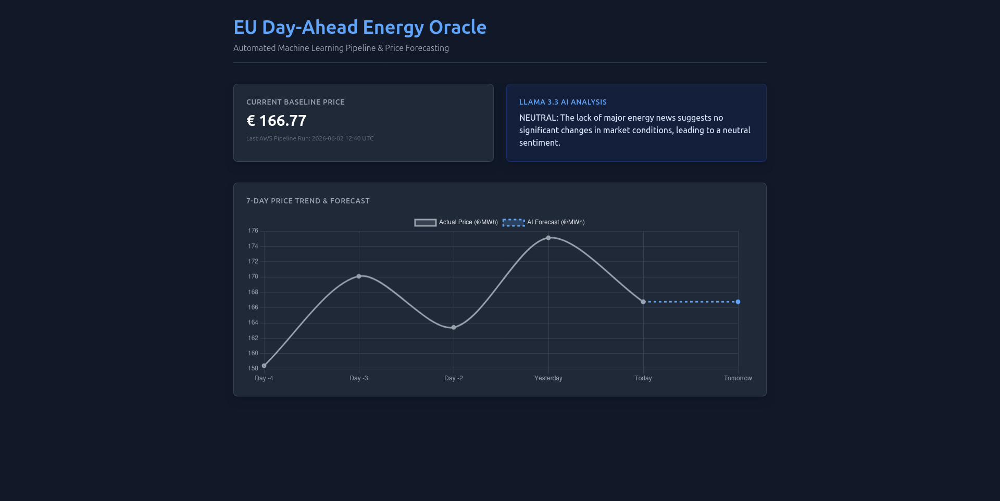
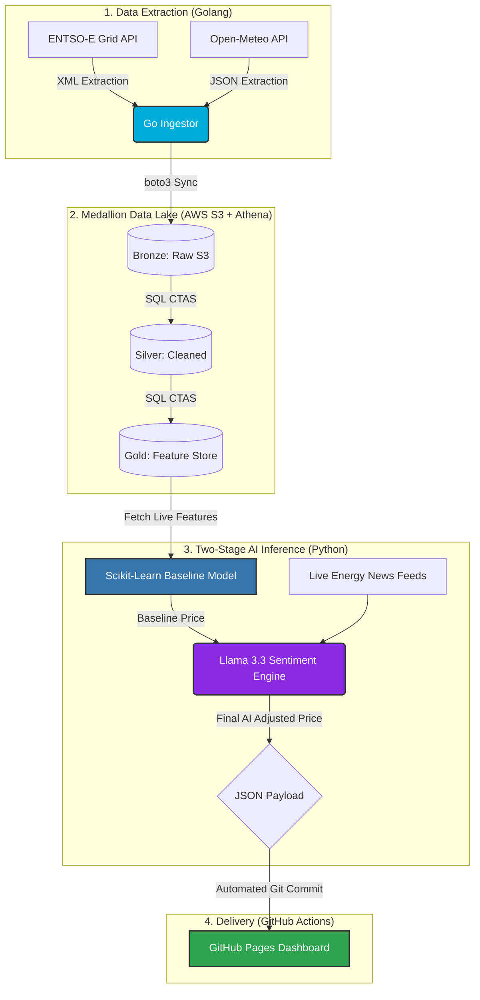

```markdown
# ⚡ EU Energy-Economy Intersection: AI-Powered Grid Forecaster


## 🎯 Problem Statement
The European Union operates one of the world's most advanced, interconnected, and deregulated electricity markets. As the EU aggressively transitions to renewable energy, grid supply has become highly weather-dependent. This dependence, coupled with macroeconomic shifts and geopolitical news, leads to extreme day-ahead electricity price volatility. 

This project builds a modern, self-healing **Big Data architecture** to ingest live EU grid data, forecast Day-Ahead Electricity Prices using a hybrid **Quantitative Machine Learning + Qualitative LLM Sentiment** approach, and serve the predictions to a live interactive dashboard.

## 🚀 Live Dashboard
The pipeline runs autonomously every morning at 06:00 UTC, pushing fresh ML inferences and AI market sentiment analysis directly to the live dashboard.

👉 **[View the Live EU Day-Ahead Energy Oracle Dashboard Here](https://sheddiboo.github.io/eu-energy-forecast/)**



---

## 🏗️ Architecture & Technology Stack

The pipeline is built on three modern data engineering pillars: Polyglot execution, Medallion storage, and strict DataOps automation.

### Pillar 1: Polyglot Pipelines
Different languages were chosen strictly for the tasks they perform best:
* **Golang (Ingestion):** Handles high-concurrency extraction of live European grid generation forecasts (via ENTSO-E XML API) and live regional weather metrics (via Open-Meteo JSON API) with sub-second execution.
* **Python (Transformation & AI):** Utilizing `uv` for lightning-fast dependency management, Python handles S3 integrations, `pandas` transformations, and all Artificial Intelligence tasks.
* **Bruin Data (Orchestration):** Replaced the initial Python orchestrator with Bruin Data for native dependency graphing, execution isolation, and robust error handling.

### Pillar 2: The Medallion Architecture (AWS & Athena)
* **🥉 Bronze (Raw):** Untransformed, live CSVs synced natively from the Go extractors into an S3 Data Lake.
* **🥈 Silver (Cleaned):** Hourly aggregated, deduped, and UTC-aligned data processed via Amazon Athena (SQL CTAS).
* **🥇 Gold (Feature Store):** Fully imputed, engineered feature store containing calculated 24h/168h lags, rolling averages, and forecast error metrics ready for model inference.

### Pillar 3: The Hybrid AI Model
The traditional approach of predicting financial markets relies solely on historical numbers. This project implements a **Two-Stage Hybrid AI** to capture both physical grid realities and human market psychology:
1. **The Quantitative Baseline (Scikit-Learn):** A regression model trained on 11 years of historical weather and physical grid generation data establishes a mathematical baseline price.
2. **The Qualitative Overlay (Groq + Llama 3.3):** An LLM acts as a "Senior Market Trader," scraping live energy news (e.g., *EnergyPost.eu*) to gauge market sentiment. It applies a bounded mathematical multiplier (e.g., Bullish 1.05x, Bearish 0.95x, Neutral 1.0x) to the baseline to produce the final forecast.

---

## ⚙️ Automated Pipeline Workflow



## 📂 Project Directory Structure

```plaintext
eu-energy-forecast/
├── .github/
│   └── workflows/
│       └── pipeline.yml           # GitHub Actions cron scheduler & auto-commit
├── assets/
│   ├── ingestion/                 # Golang API extractors (ENTSO-E, Open-Meteo)
│   ├── intelligence/              # Scikit-learn ML & Llama 3.3 Trader logic
│   └── transformations/           # AWS Athena SQL Medallion Logic
├── data/                          # Local transient data holding
├── .env.example                   # Template for required environment variables
├── .gitignore                     # Git ignore definitions
├── Makefile                       # Utility commands for local dev and execution
├── data.json                      # Data contract payload for live dashboard
├── index.html                     # Frontend UI for live portfolio dashboard
├── main.tf                        # Terraform IaC for AWS infrastructure
├── pipeline.yml                   # Bruin Data orchestration dependency graph
├── pyproject.toml                 # Python dependencies (managed by uv)
└── README.md                      # Project documentation

```

## 🛠️ Fault Tolerance & Self-Healing

A major focus of the DataOps design was ensuring dashboard uptime regardless of external API instability.

* **Resilient Targeting:** The inference script natively detects missing or delayed ENTSO-E Day-Ahead API publications and autonomously rolls back to the most recent available grid generation data.
* **Bulletproof Imputation:** Utilizes a cascading imputation strategy (`ffill` → `bfill` → zero-fill) on live inference data to guarantee the machine learning matrix never fails due to dropped API packets.
* **Idempotent Medallion Builds:** Athena transformations utilize isolated `DROP TABLE IF EXISTS` architecture, allowing the pipeline to be run ad-hoc an infinite number of times without duplicating data or breaking state.

## 👨‍💻 Local Setup & Execution

If you wish to run the pipeline locally:

1. **Install Dependencies:**
Ensure you have Go (1.21+) and `uv` installed.
```bash
uv pip install -r pyproject.toml

```


2. **Set Environment Variables:**
You will need active API keys set in your local environment or `.env` file:
* `AWS_ACCESS_KEY_ID` / `AWS_SECRET_ACCESS_KEY`
* `ENTSOE_API_KEY`
* `GROQ_API_KEY`


3. **Run Bruin Orchestrator:**
```bash
bruin run .

```


```

```