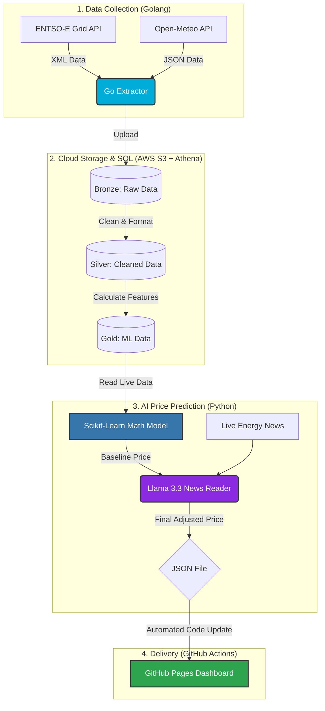

# ⚡ EU Energy-Economy Intersection: AI-Powered Grid Forecaster

## 🎯 Problem Statement

The European Union operates an advanced and interconnected electricity market. As the EU shifts to renewable energy, the power supply relies heavily on the weather. This weather dependence, combined with economic and political news, makes the price of electricity change drastically from day to day.

This project builds an automated data system to collect live European grid data, predict electricity prices for the next day, and show the results on an interactive web dashboard. It uses a combination of traditional machine learning (for analyzing historical numbers) and large language models (for reading current market news).

## 🚀 Live Dashboard

The system runs automatically every morning at 06:00 UTC, sending new price predictions and market analysis directly to the live dashboard.

👉 **[View the Live EU Day-Ahead Energy Oracle Dashboard Here](https://sheddiboo.github.io/eu-energy-forecast/)**

---

## 🏗️ Architecture & Technology Stack

The project relies on three main concepts: using the right language for the right job, organizing data into clear stages, and automating the workflow.

### Part 1: Pipeline Languages

The system uses different programming languages for specific tasks:

* **Golang (Data Collection):** Fast and efficient extraction of live power grid forecasts (ENTSO-E API) and weather data (Open-Meteo API).
* **Python (Data Processing & AI):** Uses the `uv` package manager for fast setups. Python handles the cloud storage connections, formats the data using `pandas`, and runs all the Artificial Intelligence models.
* **Bruin Data (Workflow Management):** Manages the order in which scripts run, tracks dependencies, and handles errors if a step fails.

### Part 2: The Medallion Data Architecture (AWS & Athena)

The data is stored and cleaned in three distinct stages:

* **🥉 Bronze (Raw Data):** Unprocessed, raw CSV files saved directly from the Go scripts into an Amazon S3 storage bucket.
* **🥈 Silver (Cleaned Data):** Data that has been grouped by hour, had duplicates removed, and aligned to the UTC timezone using Amazon Athena.
* **🥇 Gold (Machine Learning Ready):** The final dataset. Missing values are filled, and mathematical features (like rolling averages and past error tracking) are calculated so the machine learning model can read it easily.

### Part 3: The Hybrid AI Model

Predicting energy prices requires more than just looking at past numbers. This system uses a two-step approach:

1. **The Math Model (Scikit-Learn):** A machine learning model trained on 11 years of historical weather and grid data calculates a baseline price.
2. **The AI Trader (Groq + Llama 3.3):** An AI language model reads live energy news websites to understand the current mood of the market. It then applies a multiplier to the math model's price (for example, raising it slightly if the news is negative, or keeping it the same if the news is neutral) to create the final forecast.

---

## ⚙️ Automated Pipeline Workflow



## 📂 Project Directory Structure

```plaintext
eu-energy-forecast/
├── .github/
│   └── workflows/
│       └── pipeline.yml           # Automation rules for daily execution
├── assets/
│   ├── ingestion/                 # Golang scripts to download API data
│   ├── intelligence/              # Python scripts for machine learning and AI
│   └── transformations/           # SQL queries for cleaning data in AWS
├── data/                          # Temporary local folder for holding files
├── .env.example                   # Template for secret API keys
├── .gitignore                     # Lists files that Git should ignore
├── Makefile                       # Shortcut commands for running the project
├── data.json                      # The final output file read by the dashboard
├── index.html                     # The frontend website code for the dashboard
├── main.tf                        # Terraform code to build AWS resources
├── pipeline.yml                   # Instructions for the Bruin Data manager
├── pyproject.toml                 # List of required Python packages
└── README.md                      # Project documentation

```

## 🛠️ Error Handling & Reliability

A major focus of the system is ensuring the dashboard stays online even if external websites go down.

* **Smart Data Searching:** If the European grid website is late publishing tomorrow's data, the Python script automatically detects this and falls back to using the most recent available data to make a prediction.
* **Handling Missing Data:** If external sources fail to provide specific data points, the system automatically fills the empty spaces with the most recent known numbers or safe defaults (zeros). This prevents the entire program from crashing.
* **Safe Reprocessing:** The database building process safely deletes and recreates tables on every run. This means the system can be restarted as many times as needed without accidentally duplicating data.

## 👨‍💻 Local Setup Instructions

To run this project on a local machine:

1. **Install Requirements:**
Ensure Go (version 1.21 or higher) and the `uv` Python package manager are installed.
```bash
uv pip install -r pyproject.toml

```


2. **Set Secret Keys:**
Active API keys must be set in the local environment or inside a `.env` file:
* `AWS_ACCESS_KEY_ID` / `AWS_SECRET_ACCESS_KEY`
* `ENTSOE_API_KEY`
* `GROQ_API_KEY`


3. **Run the System:**
Execute the workflow manager to start the pipeline:
```bash
bruin run .

```